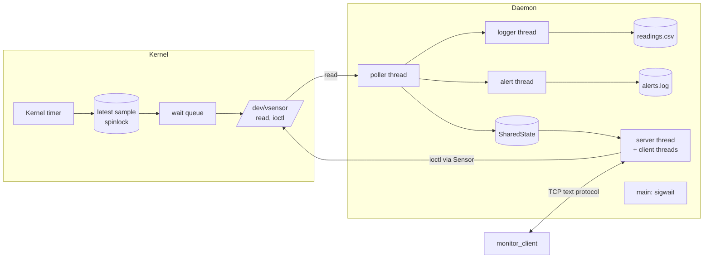
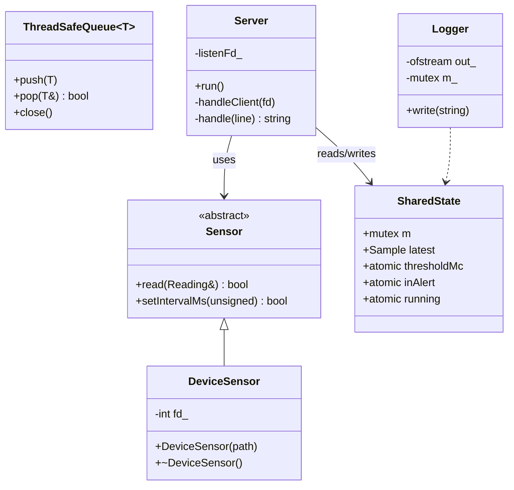
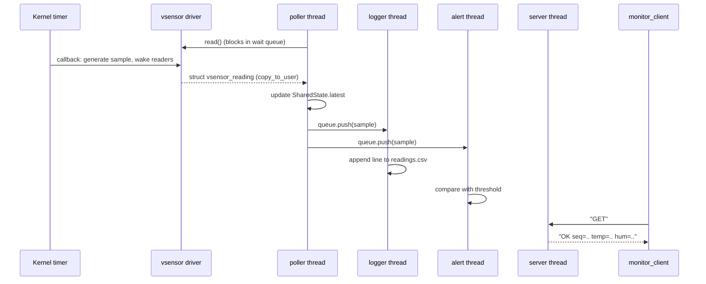
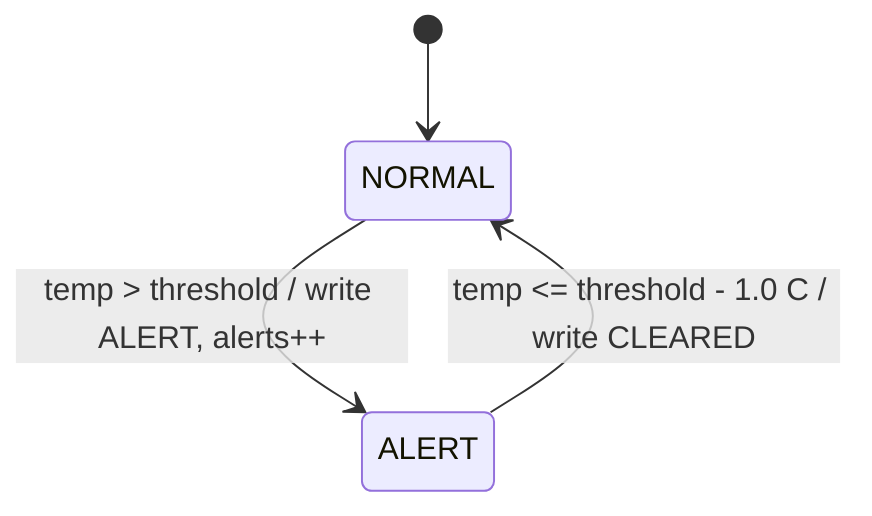

# Design Document

## 1. Requirements

**Functional**

| ID | Requirement |
|---|---|
| FR1 | The driver exposes `/dev/vsensor`; `read()` returns one sensor sample. |
| FR2 | The driver produces a new sample every `interval_ms` using a kernel timer. |
| FR3 | `read()` blocks until a new sample exists (no busy polling). |
| FR4 | The interval is changeable through `ioctl` and a module parameter. |
| FR5 | The daemon reads continuously and logs each sample to `readings.csv`. |
| FR6 | The daemon raises an alert when temperature exceeds a configurable threshold and clears it with hysteresis. |
| FR7 | Remote clients can query data and change settings over TCP. |
| FR8 | The daemon shuts down cleanly on SIGINT/SIGTERM and can run as a background daemon. |

**Non-functional:** thread safety (no data races), no busy waiting, no leaks (RAII), robust error handling,
builds with `make`, localhost-only network by default.

## 2. Architecture

## 3. Class diagram (user space)

## 4. Sequence diagram: one sample, end to end

## 5. State machine: alert logic

The 1 °C hysteresis stops the system from flapping between states when the
temperature hovers around the threshold.

## 6. Key design decisions

| Decision | Reason |
|---|---|
| Spinlock (not mutex) in the driver | The timer callback runs in softirq context and may not sleep. |
| Snapshot under lock, `copy_to_user` after unlock | `copy_to_user` can fault and sleep; sleeping while holding a spinlock is a bug. |
| Per-open `last_seq` in `private_data` | Each reader gets every sample; blocking read without busy polling. |
| `stopping` flag + `timer_delete_sync` on unload | A self-re-arming timer could otherwise re-arm after we waited for it. |
| Milli-units (`int`) instead of `float` | Floating point must not be used in the kernel. |
| Signals handled with `sigwait` in one thread | No async-signal-handler restrictions; threads shut down in an orderly way. |
| `Sensor` abstract base class | Lets tests substitute a FIFO for the driver without changing daemon code. |
| Fixed-width shared header | Kernel and user space always agree on the data layout. |

## 7. Test plan

| Level | What | How |
|---|---|---|
| Unit-like | Alert hysteresis, command parsing | Driven through `run_tests.sh` with the deterministic `ramp` sensor |
| Integration | Daemon + sensor + loggers + TCP | `make test` (fake sensor) |
| System | Real driver + daemon + client in a VM | Manual, see README "Run with the real driver" |
| Concurrency | Data races | Build with `-fsanitize=thread` and run the test |
| Error paths | Bad commands, unsupported ioctl, SIGTERM | Covered in `run_tests.sh` |

## 8. Suggested Git workflow

`main` (stable) ← `develop` ← feature branches: `feature/driver-chardev`, `feature/driver-timer`,
`feature/daemon-threads`, `feature/tcp-server`, `docs`. Commit small and often.
